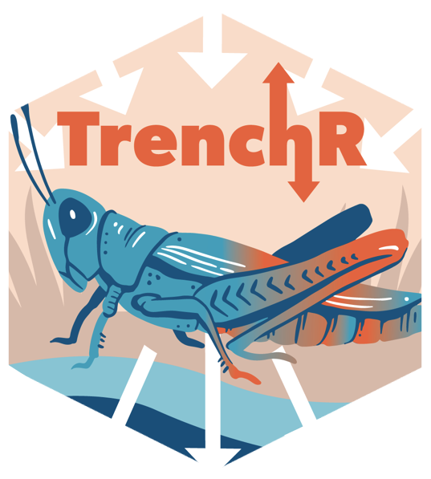

# TrenchR
--------------------------------------------------------------

an R package for transparent environmental and ecological biophysics



**Author:** [TrEnCh project, Buckley Lab, Department of Biology, University of Washington](https://trenchproject.github.io)<br>
**License:** [MIT](http://opensource.org/licenses/MIT)<br>

[](https://travis-ci.org/trenchproject/TrenchR)
[](https://nsf.gov/awardsearch/showAward?AWD_ID=1349865)

[Package website](https://trenchproject.github.io/TrenchR/)

### Description
The TrenchR package aids in Translating Environmental Change into organismal responses (https://github.com/trenchproject/TrenchR). The package facilitates microclimate modelling to translate weather station data into the environmental conditions experienced by organisms and biophysical modelling to predict organismal body temperatures given the environmental conditions. The package aims to introduce and enable microclimate and biophysical modelling to improve ecological and evolutionary forecasting and includes tutorials and well as a series of educational modules introducing microclimate and biophysical modelling. The package complements and integrates with the NicheMapR package (https://github.com/mrke/NicheMapR). 

### Installation
You can install the package from the [github repository](https://github.com/trenchproject/TrenchR):

```r
install.packages("devtools")   
library("devtools")   
devtools::install_github(build_vignettes = TRUE,repo = "trenchproject/TrenchR")
```

### Using the package
The package encompasses simple functions that can be combined to estimate environmental conditions and their impacts on organisms. Many of the functions are adapted from biophysical ecology texts including the following:
* Gates DM. Biophysical Ecology.
* Campbell GS and Norman JM. An introduction to environmental biophysics.

### Package Vignette
We introduce each function in categorically grouped tutorials.  A good place to start is the Allometry and conversions tutorial, which provides tools for preparing data such as estimating additional dimensions of organisms from measured dimensions. 

```r
vignette("AllometryAndConversionsTutorial.Rmd", package="TrenchR")

```

The Estimating microclimates tutorial provides resources for estimating the environmental conditions experienced by organisms.  This includes estimating solar radiation and its components, diurnal variation in temperature and radiation, temperature and wind speed profiles, and soil temperatures and profiles. 

```r
vignette("MicroclimateTutorial", package="TrenchR")

```

Finally, the core biophysical modelling functions are described in a tutorial on Using energy balances to estimate body temperatures. Components of an energy budget can be estimated using individual functions and then operative environmental temperatures, Te, can be solved for using either a generic energy balance or taxa specific biophysical models.

```r
vignette("TeTutorial", package="TrenchR")

```

### Future Directions
We welcome code contributions, fixes, and comments. Code (scripts and functions) will be accepted in any programming language and thorough commenting will be appreciated.  We would also appreciate your including a header that describes the intent, input, and output of your scripts and functions. 

### Citation
If you use this package, We would appreciate a citation. You can see an up to date citation information with `citation("TrenchR")`. You can cite either the package or the accompanying journal article.

### Setup
If you are using macOS, you might need to install R package "rgl" which indirectly would ask you to install XQuartz. The reason for it is that there is a dependency for package "ks".

### Developer notes
Update documentation: devtools::document()
